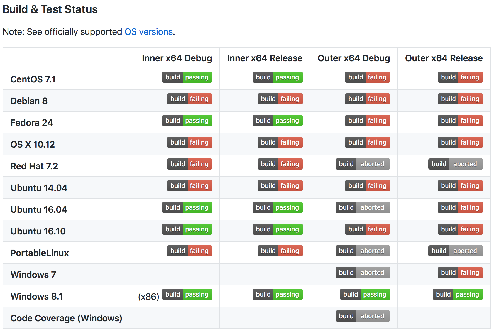

# Test Driven Development 

## Learning Competencies
- API Testing
- Types of Testing
	- Integration Testing
	- End to End Testing
- Automation with Travis CI

## Overview

### Test a Node RESTful API with Mocha and Chai

#### Introduction

Test a Node RESTful API with with Mocha and Chai

Check the complete `Bookstore` application on this [link](https://scotch.io/tutorials/test-a-node-restful-api-with-mocha-and-chai#toc-bonus-mockgoose)

`POSTMAN` is not good enough to test your application. So, you'll have to test your application using a proper testing framework. So, you could test for edge cases.

Testing should atleast check for following cases:

- `/GET` Routes
- `/POSt` Routes
- `/GET/:id` Route
- `/PUT/:id` Route
- `/DELETE/:id` Route

### End-To-End Testing

End-to-end testing is where you test your whole application from start to finish. It involves assuring that all the integrated pieces of an application function and work together as expected.

End-to-end tests simulate real user scenarios, essentially testing how a real user would use the application.

[Go to link and study how to do End-to-End Testing](https://medium.freecodecamp.org/why-end-to-end-testing-is-important-for-your-team-cb7eb0ec1504)

### Integration Testing

**[Difference b/w intergration testing & unit testing](https://stackoverflow.com/questions/37605811/separation-of-unit-tests-and-integration-tests)**

#### Introduction
Integration testing (sometimes called integration and testing, abbreviated I&T) is the phase in software testing in which individual software modules are combined and tested as a group. It occurs after unit testing and before validation testing. Integration testing takes as its input modules that have been unit tested, groups them in larger aggregates, applies tests defined in an integration test plan to those aggregates, and delivers as its output the integrated system ready for system testing.

Follow this link to read more about [Integration testing](http://softwaretestingfundamentals.com/integration-testing/)

### Automation with Travis CI(Continous Integration)

Travis is written in Ruby under MIT Licence. It's an open source project maintained by Travis CI community

Have you ever seen build statues on Github? Ever wondered how they work? Click on the below picture to go to original Repository & see what repo this picture belongs to

Sometime as your project starts to grow you have to help from bots to do heavy lifting for you. There is when Travis CI comes in pictures. Read more [here](http://onlythepixel.com/2017/11/15/continuous-integration-for-express-apis-with-travis-ci/)

## Exploration

- [API testing with Jest](https://hackernoon.com/api-testing-with-jest-d1ab74005c0a)
- [Chakram is a REST API testing framework
offering a BDD testing style and fully exploiting promises](http://dareid.github.io/chakram/)
- [Learn Travis from Github official Repo](https://github.com/dwyl/learn-travis)
- [Types of Testing](http://www.softwaretestinghelp.com/types-of-software-testing/)