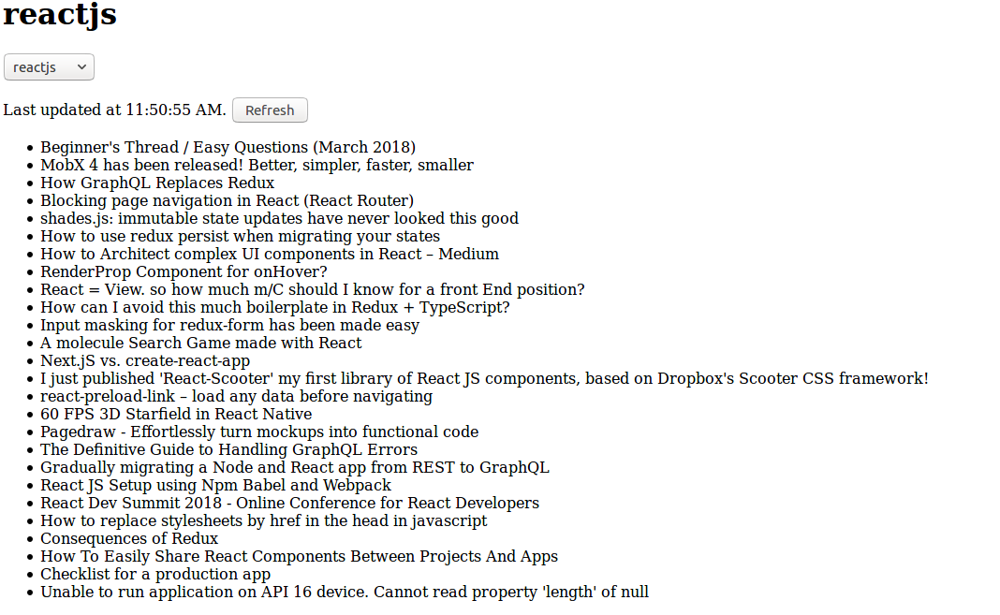

## Release 0

Create Reddit headline fetching application by using two options: 
1.reactjs
2.frontend

You can fetch the headline of particular keyword from the link: 

`http://www.reddit.com/r/${reddit}.json`

where `reddit` = option(reactjs/frontend)

here is the demo of application

## Release 1

Create `actions`, `reducers`, `containers`, `components` which are useful for this applications.

Use the necessary middlewares like `redux-thunk`, `redux-logger`

## Release 2

Style the application using bootstrap and css
